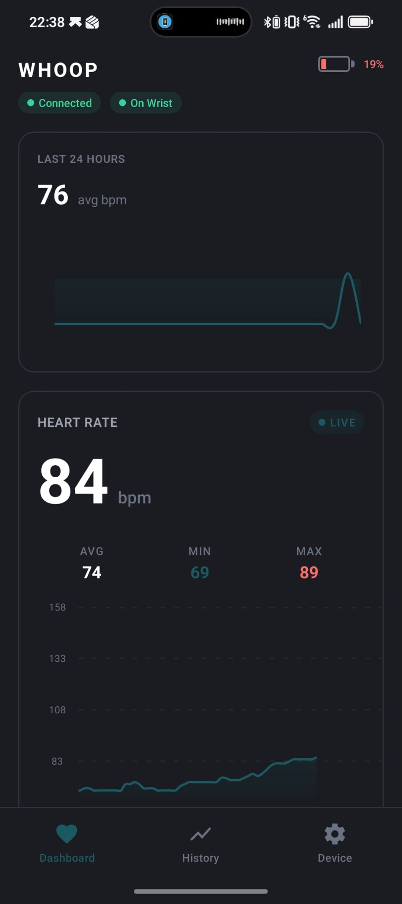
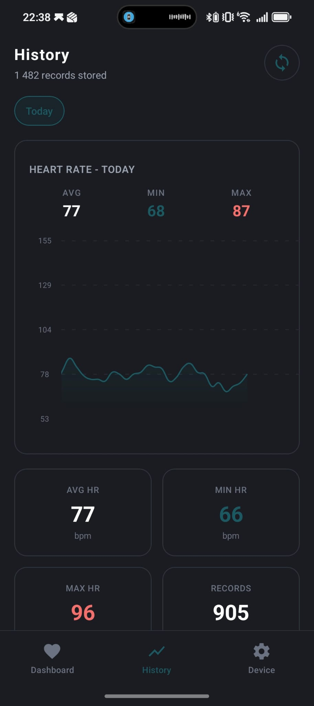
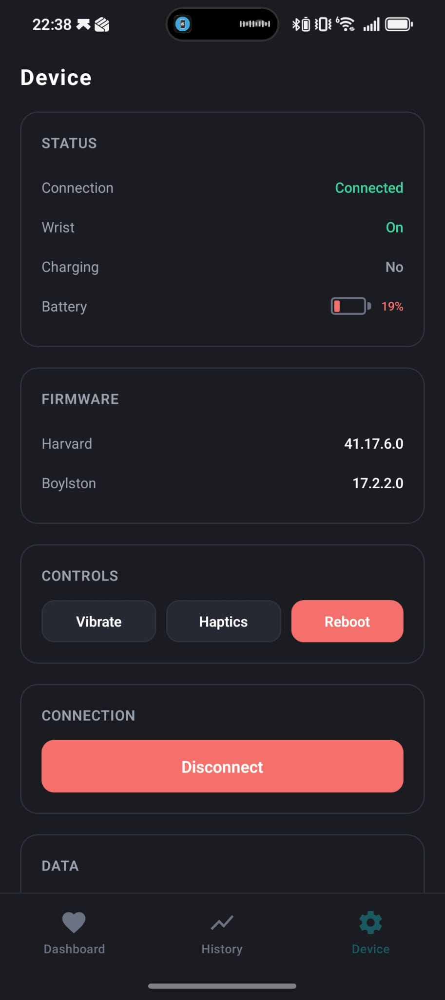

# whoop-app

Reverse engineered Whoop 4.0 app, without subscription, basic functionality.
Inspired by great work of jogolden (check out his profile): <https://github.com/jogolden/whoomp>

  
  
  

 

This is a proof of concept project. I'm really into biosensorics and wearables, but unlike the official WHOOP app, I can't really process or make sense of any of the data — that's on my todo list though. I'm not sponsored by WHOOP and I definitely don't want to cause any harm to the company — actually, I'm really impressed with what WHOOP is building. Now that the WHOOP 5.0 is out, I figured it would be a cool time to mess around with the 4.0 hardware and see what we can do with it.

